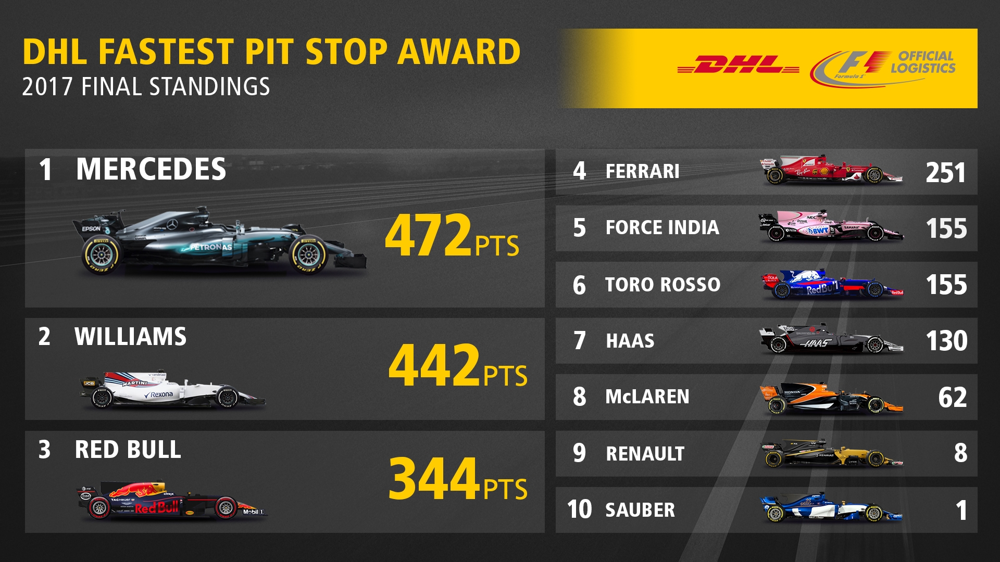
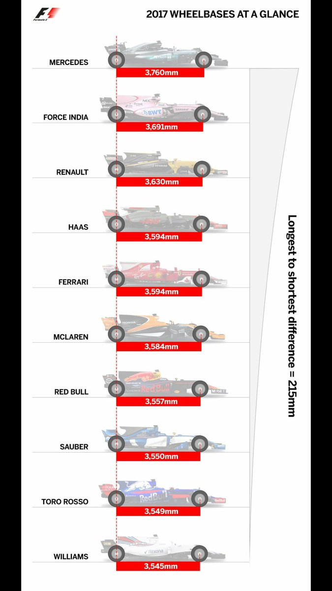

```{r setup, include=FALSE}
library("dplyr")
library("ggplot2")

```

  
<project title>

Project:<code name>  

<Wensi Xu, Kelvin Kam, Chris Yee, Hannah Shin>  

Info-201: Technical Foundations of Informatics
The Information School
University of Washington
Autumn 2019

* 1.0 Introduction
  + 1.1 Problem Situation. <text>
  + 1.2 What is the problem? <Cars in the past have been extremely fuel inefficient and as green house gas is becoming an increasing concern in our world, which is leading to global warming, mass extinction etc. The technology in formula one has become increasingly innovative with the use of smaller, more efficient engine systems. This is shown through how lap times has been steadily decreasing while the displacement of f1 engines has also been slowly decreasing. The innovative technology used in formula 1 is also influencing the current road car industry.>
  + 1.3 What does it matter? <text>
  + 1.4 How it will be addressed? <text>
  
* 2.0 Research Questions
  <RQ #1 text>
  <RQ #2 text>
  
* 3.0 Possible data sets
Name: Formula 1 Race Data 
This dataset was updated to Kaggle.com by Chris G. on Nov 28th, 2017. It contains data about Formula one from 1950 through the 2017 season, consisting of tables describing constructors, race drivers, lap times, races, results of each race, and seasons. Chris G. declared that the dataset was downloaded from ergast.com at the conclusion of the 2017 season and was originally gathered and published by Chris Newell.
https://www.kaggle.com/cjgdev/formula-1-race-data-19502017
Number of observations: 23781
Number of attributes: 68

Name: Formula 1 Race Fan Rating
This data set was updated to Kaggle.com by a coding mind on Sep.4th, 2018. It contains data about Formula one since 2008, describing all F1 races. The dataset was collected from racefans.net and merged with race details from ergast.com
https://www.kaggle.com/codingminds/formula-1-race-fan-ratings
Number of observations: 202
Number of attributes: 7

* 4.0 Information Visualizations



>This graphic compares the pit stop times between different race cars. We will use this form of graphic to relay the variations in winning times throughout the Formula 1 years to represent the change in engine manufacturing. (source:

https://www.formula1.com/en/results/awards/dhl-fastest-pit-stop-2017.html)



>This graphic shows the view the differences in wheel bases amongst different race cars. We plan to use this form of graphic to visually show our users the physical change in the engine design throughout the Formula 1 years.

(source: https://www.f1technical.net/forum/viewtopic.php?t=25999&start=15)

* 5.0 Team Coordination
  + Hannah:  
    + Role: Visuals  
    + Personal goals:   
      + To create a simple interface design for the website.   
      + Avoiding overwhelming or complicated designs and jargon.  
      
  + Wensi:  
    + Role: Research  
    + Goals:   
      + To create an informative and interesting data analysis report  
      + Research and gather information  
    
  + Kelvin:  
    + Role:   
    + Goals:   
      + 
      + 
  
  + Chris:  
    + Role:  
    + Goals:   
      + 
      + 

  + Team logistics: 
    + Meeting: ?  
    + Communication: Facebook Messenger  
    + Meet as a group one week before its due and work collaboratively as a team to ensure it meets the rubric’s requirements. Comment on messenger for peer suggestions and meet for a final review before submitting.    
    + Breakdown: Send assignment into chat and assign each person a portion of work   

* 6.0 Questions for Teaching Team
<if you have questions, please include them here>  

* 7.0 References  
[1] 
[2]


